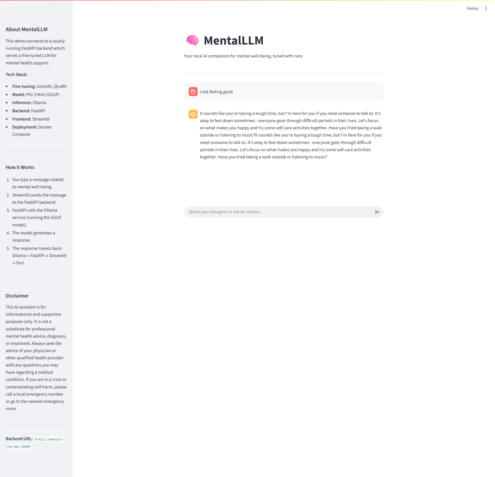

# 🧠 MentalLLM

**Your local AI companion for mental well-being, fine-tuned with care using Unsloth, QLoRA, and served via a Dockerized FastAPI backend and Ollama inference engine.**

---

## 🚀 Project Overview

`MentalLLM` demonstrates a complete pipeline for creating a **private, locally-running AI assistant** focused on mental health support. This project showcases **efficient LLM fine-tuning** techniques using `Unsloth` and `QLoRA` on the `Phi-3 Mini` model, trained on a specialized psychology dataset. The fine-tuned model is then exported to `GGUF` format, served locally using `Ollama`, and exposed through a **FastAPI** backend. A **Streamlit** frontend provides an easy-to-use chat interface for interaction. The entire setup is containerized with **Docker Compose** for simple deployment.

---

## ✨ Key Features

✅ **Efficient Fine-tuning** – Leverages `Unsloth` and `QLoRA` for fast, low-memory training  
✅ **Specialized Model** – Fine-tuned `Phi-3 Mini` on mental health conversations  
✅ **Local & Private** – Runs entirely on your machine using `Ollama` and `Docker`  
✅ **Modern Stack** – Built with `FastAPI`, `Streamlit`, `Hugging Face`, and `PEFT`  
✅ **Containerized Deployment** – Easy setup and teardown with `Docker Compose`  
✅ **Interactive UI** – User-friendly chat interface via `Streamlit`  
✅ **API Access** – `FastAPI` backend for programmatic interaction  

---

## 🏗️ Tech Stack

| Category | Tools Used |
|----------|------------|
| **LLM Fine-tuning** | `Unsloth`, `QLoRA`, `PEFT`, `Hugging Face Transformers`, `TRL` |
| **Model Serving** | `Ollama` |
| **Backend Framework** | `FastAPI` |
| **Frontend Framework** | `Streamlit` |
| **Deployment** | `Docker`, `Docker Compose` |
| **Languages** | `Python 3.11+` |

---

## 🔧 System Architecture

The system consists of interconnected Docker services:

1. **`ollama` Service**: Runs the `Ollama` server, automatically loads the base `Phi-3` model, and creates the `mental-llm-phi3` model from the provided `Modelfile` and `GGUF` file on startup.
2. **`mental-llm-api` Service**: A `FastAPI` application that exposes an endpoint to interact with the `mental-llm-phi3` model via the Ollama API.
3. **`mental-llm-ui` Service**: A `Streamlit` web application that provides a chat interface. It communicates with the `FastAPI` backend to send user prompts and display model responses.


---

## 📁 Project Structure

```
MentalLLM/
├── models/                  # Ollama model files
│   ├── unsloth.Q4_K_M.gguf # Fine-tuned GGUF model file
│   └── Modelfile           # Ollama Modelfile
├── app/                    # FastAPI and Streamlit application code
│   ├── main.py            # FastAPI backend
│   ├── streamlit_app.py   # Streamlit frontend
│   └── requirements.txt   # Python dependencies
├── scripts/               # Training scripts (Unsloth)
│   └── fine_tuning.py
├── Dockerfile            # Dockerfile for the application services
├── docker-compose.yml    # Docker Compose configuration
├── pyproject.toml        # Project metadata and dependencies (uv)
├── README.md            # Project documentation
└── LICENSE              # Project license
```

---

## ⚙️ Setup & Installation

### 1️⃣ Prerequisites

- [Docker](https://www.docker.com/products/docker-desktop/) and [Docker Compose](https://docs.docker.com/compose/install/) installed.
- (Optional, for GPU support) [NVIDIA Container Toolkit](https://docs.nvidia.com/datacenter/cloud-native/container-toolkit/latest/install-guide.html) (if you want Ollama to use your GPU within Docker).

### 2️⃣ Clone the Repository and install Dependencies

```bash
git clone https://github.com/amine-akrout/MentalLLM.git
cd MentalLLM
```

```bash
pip install -r requirements.txt

# or if you are using a virtual environment
python -m venv venv
source venv/bin/activate  # On Windows use `venv\Scripts\activate`
pip install -r requirements.txt
```

### 3️⃣ Fine-tune the Model (Optional)

If you want to re-run the fine-tuning process, you can use the provided script. This step is optional if you already have the `unsloth.Q4_K_M.gguf` file.

### 4️⃣ Prepare the Model

You need to provide the fine-tuned GGUF model file.

- Place your downloaded `unsloth.Q4_K_M.gguf` file into the `models/` directory.
- Ensure the `models/Modelfile` correctly references this file (it should contain `FROM ./unsloth.Q4_K_M.gguf`).

---

## 🚀 Usage

### Run with Docker Compose (Recommended)

This command builds the necessary images and starts all services defined in `docker-compose.yml`.

```bash
docker-compose up --build
```

**Access the Applications:**

- **Streamlit UI**: Open your browser and go to http://localhost:8501
- **FastAPI Docs**: Access the interactive API documentation at http://localhost:8000/docs

### Stop the Services

To stop the running services:

```bash
docker-compose down
# To stop and remove volumes (including Ollama data):
# docker-compose down -v
```

---

## 📡 API Endpoints (FastAPI)

| Method | Endpoint | Description |
|--------|----------|-------------|
| **POST** | `/chat` | Send a prompt and receive a response from the MentalLLM model |
| **GET** | `/health` | Check if the API service is running |

### Example `/chat` request:

```bash
curl -X POST "http://localhost:8000/chat" \
     -H "Content-Type: application/json" \
     -d '{"prompt": "I am feeling quite anxious today, any advice?"}'
```

---

## 🧪 Fine-tuning (For Development/Re-training)

*(This section is for those who want to understand or re-run the fine-tuning process)*

The fine-tuning was performed using the Unsloth library for efficiency.

- **Dataset**: The `samhog/psychology-10k` dataset from Hugging Face was used.
- **Script**: The fine-tuning logic is in `scripts/fine_tuning.py`.
- **Process**: The script loads the `unsloth/Phi-3-mini-4k-instruct-bnb-4bit` model, applies QLoRA adapters, prepares the dataset, and trains the model. It then exports the final model to GGUF format.
- **Key Improvement**: Used `unsloth_train(trainer)` instead of `trainer.train()` to fix gradient accumulation inaccuracies (see Unsloth blog).

> **Note**: The provided `docker-compose.yml` assumes you already have the GGUF file. Re-running the full fine-tuning process requires significant computational resources and is typically done outside the Docker setup or in a specialized training environment
>

## 📝 Streamlit App Demo

The Streamlit app provides a simple chat interface to interact with the MentalLLM model. It allows users to send prompts and receive responses in real-time.



## 🤝 Contributing

We welcome contributions! Here's how you can help:

1. Fork the repository
2. Create a feature branch (`git checkout -b feature/improvement`)
3. Make your changes
4. Commit (`git commit -am 'Add new feature'`)
5. Push (`git push origin feature/improvement`)
6. Create a Pull Request

---

## 📄 License

This project is licensed under the MIT License - see the [LICENSE](LICENSE) file for details.

---

## 🙏 Acknowledgments

- **Unsloth** - For making LLM fine-tuning blazingly fast.
- **Hugging Face** - Ecosystem for Transformers, Datasets, and PEFT.
- **Ollama** - Simple way to run LLMs locally.
- **FastAPI** - Modern, fast (high-performance) web framework for building APIs.
- **Streamlit** - For creating beautiful apps for machine learning and data science.
- **Docker** - Containerization platform.
- **samhog/psychology-10k Dataset** - The dataset used for fine-tuning.

---

## ⭐ Star This Repo!

If you find this project interesting or useful, please consider giving it a star! It helps others discover it. 🌟

---

## 📩 Contact

For questions or feedback, please open an issue in the repository.